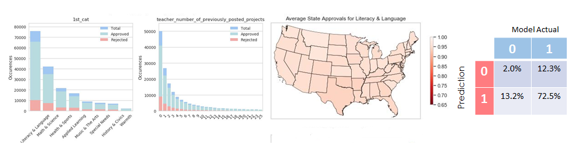

# Springboard Capstone Project 2:  Donor's Choose

This project is a binary classification problem that relies on numerical, categorical, and textual inputs.  The "client" is Donor's Choice, an organization that runs a matching site for school projects and people willing to fund those projects.  Donor's choice is described in both the interim report and the final results summary, but it is important to note that this dataset was originally used as a Kaggle competition, which provided a solid frame of reference for evaluating the eventual model.

From a project perspective, all of the basic steps are contained in this project: visualization, cleaning, analysis, model construction and evaluation. The diagrams above show examples of what is contained in the various workbooks:

In Notebook 1, basic cleaning and visualization are performed.  It quickly becomes clear that on average, 85% of the proposals are approved on the inital human review.  This is a relatively robust conclusion across most high level slices.  However, upon deeper examination, differences emerge across subjects, geographies, and cost levels.  Those initial insights drive the choice of features for the eventual model.

In Notebook 2, detailed cost desriptions are derived and mapped by state and subject.  A wide range between the top approval rate (Warmth) and the lowest approval rate (Special Needs) as well as a difference between the top subjects with the highest numbers of proposals (Launguage and Literacy outperforms Math and Science in terms of approvals by almost 2% on average, and varies greatly across states.)   Additionally, it becomes clear that basic text analysis yields a significant improvement in the roc score, and the first real improvement in the False Positive portion of the confusion matrix.

In Notebook 3, models are developed using four separate classifiers: Logistic Regression, Gradient Boost, Random Forest (all from sklearn), and Light Gradient Boost using its own proprietary api. The performance of each of the classifiers is plotted across an increasing level of features.  LGB emerged as the best performing classifier in this situation, due in large part to its computational and memory efficiencies.

Finally the results are summarized in the results summary pdf.  In short, the model was able to reduce the false positive level by almost 13%.  See the pdf for further details, as well as recomendations that emerged from the data set.


```python

```


```python

```


```python

```


```python

```


```python

```
